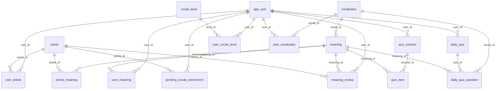

# Database schema

> Generated by `tools/gen_schema_doc.py` from `schema.sql` -- do not edit by hand.
> `schema.sql` is the single source of truth; `reset.sql` is generated from it too.

17 tables, PostgreSQL. Every table has Row Level Security enabled (the backend connects as `postgres`, which bypasses it).

## Tables

| Table | What it holds |
|---|---|
| [`app_user`](#app_user) | users |
| [`pending_signup`](#pending_signup) | pending signups (email + 6-digit code, before account exists) |
| [`vocabulary`](#vocabulary) | vocabulary items |
| [`article`](#article) | articles |
| [`user_article`](#user_article) | user <-> article relation |
| [`meaning`](#meaning) | meanings (one vocabulary word can have multiple senses) |
| [`user_meaning`](#user_meaning) | user <-> meaning relation |
| [`user_vocabulary`](#user_vocabulary) | user <-> vocabulary relation |
| [`article_meaning`](#article_meaning) | article <-> meaning relation |
| [`vocab_level`](#vocab_level) | vocabulary-size tiers (1-10, each split into IV/III/II/I sub-tiers) |
| [`pending_vocab_enrichment`](#pending_vocab_enrichment) | pending vocab enrichment retry queue |
| [`user_vocab_level`](#user_vocab_level) | user <-> vocab_level binding (each user's current tier) |
| [`daily_quiz`](#daily_quiz) | one AI-generated quiz session per user per calendar day |
| [`daily_quiz_question`](#daily_quiz_question) | AI-generated multiple-choice questions belonging to one quiz |
| [`quiz_session`](#quiz_session) | one practice session (Quick Test) |
| [`quiz_item`](#quiz_item) | one Quick Test question |
| [`meaning_review`](#meaning_review) | the review log — every review of a user's meaning, and every level set by hand, with the status before and after. The reading gates (4→5, 8→9) are counted from it. |

## Relationships

## app_user

users

| Column | Type | Null | Default | Notes |
|---|---|---|---|---|
| `id` | uuid | no | gen_random_uuid() | PK |
| `display_name` | text | yes |  |  |
| `email` | text | no |  | unique |
| `email_verified` | boolean | no | false |  |
| `auth_provider` | text | no |  | e.g. "google" |
| `auth_provider_user_id` | text | no |  | provider unique id (Google "sub"); equals email for local auth |
| `password_hash` | text | yes |  | bcrypt hash; NULL for OAuth users |
| `date_of_birth` | date | yes |  |  |
| `gender` | text | yes |  |  |
| `is_active` | boolean | no | true |  |
| `terms_accepted_at` | timestamp with time zone | yes |  |  |
| `email_verification_token` | text | yes |  |  |
| `email_verification_token_expires_at` | timestamp with time zone | yes |  |  |
| `password_reset_token` | text | yes |  |  |
| `password_reset_token_expires_at` | timestamp with time zone | yes |  |  |
| `last_password_changed_at` | timestamp with time zone | yes |  |  |
| `failed_login_attempts` | integer | no | 0 |  |
| `locked_until` | timestamp with time zone | yes |  |  |
| `avatar_url` | text | yes |  |  |
| `locale` | character varying(35) | yes |  |  |
| `profile_completed` | boolean | no | false |  |
| `onboarding_quiz` | boolean | no | false |  |
| `created_at` | timestamp with time zone | no | now() |  |
| `updated_at` | timestamp with time zone | no | now() |  |
| `last_login_at` | timestamp with time zone | yes |  |  |

**Constraints**

- `app_user_email_key` (unique): `UNIQUE (email)`
- `uq_user_provider_identity` (unique): `UNIQUE (auth_provider, auth_provider_user_id)`

**Triggers**

- `trg_app_user_updated_at`: sets `updated_at` on every update

## pending_signup

pending signups (email + 6-digit code, before account exists)

| Column | Type | Null | Default | Notes |
|---|---|---|---|---|
| `id` | uuid | no | gen_random_uuid() | PK |
| `email` | text | no |  | unique |
| `verification_code` | text | no |  |  |
| `code_expires_at` | timestamp with time zone | no |  |  |
| `attempts` | integer | no | 0 |  |
| `created_at` | timestamp with time zone | no | now() |  |
| `updated_at` | timestamp with time zone | no | now() |  |

**Constraints**

- `pending_signup_email_key` (unique): `UNIQUE (email)`

**Triggers**

- `trg_pending_signup_updated_at`: sets `updated_at` on every update

## vocabulary

vocabulary items

| Column | Type | Null | Default | Notes |
|---|---|---|---|---|
| `id` | bigint | no | nextval('vocabulary_id_seq'::regclass) | PK |
| `term` | text | no |  | always stored in base/dictionary form e.g. "take", "car" |
| `frequency_rank` | integer | yes |  | 1 = most frequent English word; drives onboarding-quiz binding (NULL = unranked) |
| `is_phrase` | boolean | no | false |  |
| `is_abbreviation` | boolean | no | false |  |
| `full_form` | text | yes |  | e.g. "Chief Executive Officer" for "CEO", null for normal terms |
| `irregular_forms` | text | yes |  | comma-separated irregular inflections e.g. "took, taken, taking" |
| `pronunciation` | text | yes |  | IPA or phonetic respelling, e.g. "/boʊt/" |
| `definition_en` | text | yes |  |  |
| `part_of_speech` | text | yes |  |  |
| `created_at` | timestamp with time zone | no | now() |  |
| `updated_at` | timestamp with time zone | no | now() |  |

**Indexes**

- `idx_vocabulary_frequency_rank`: `index on vocabulary USING btree (frequency_rank)`
- `uq_vocabulary_term_lower`: `unique index on vocabulary USING btree (lower(term))`

**Triggers**

- `trg_vocabulary_updated_at`: sets `updated_at` on every update

## article

articles

| Column | Type | Null | Default | Notes |
|---|---|---|---|---|
| `id` | uuid | no | gen_random_uuid() | PK |
| `title` | text | no |  |  |
| `content` | text | no |  |  |
| `source_url` | text | yes |  |  |
| `created_at` | timestamp with time zone | no | now() |  |
| `updated_at` | timestamp with time zone | no | now() |  |

**Triggers**

- `trg_article_updated_at`: sets `updated_at` on every update

## user_article

user <-> article relation

| Column | Type | Null | Default | Notes |
|---|---|---|---|---|
| `user_id` | uuid | no |  | PK; FK -> `app_user` (on delete cascade) |
| `article_id` | uuid | no |  | PK; FK -> `article` (on delete cascade) |
| `saved_at` | timestamp with time zone | no | now() |  |

**Constraints**

- `user_article_pkey` (primary key): `PRIMARY KEY (user_id, article_id)`

**Indexes**

- `idx_user_article_article_id`: `index on user_article USING btree (article_id)`

## meaning

meanings (one vocabulary word can have multiple senses)

| Column | Type | Null | Default | Notes |
|---|---|---|---|---|
| `id` | bigint | no | nextval('meaning_id_seq'::regclass) | PK |
| `vocab_id` | bigint | no |  | FK -> `vocabulary` (on delete cascade) |
| `sense_key` | text | no |  | short snake_case key, e.g. "noun_financial_institution" |
| `wordnet_sense_id` | text | yes |  |  |
| `definition` | text | no |  |  |
| `explanation_zh` | text | yes |  | Chinese explanation of this specific sense |
| `part_of_speech` | text | yes |  |  |
| `example_sentence` | text | yes |  |  |
| `example_sentence_zh` | text | yes |  | Chinese translation of example_sentence |
| `rank` | integer | no | 1 | 1 = most common sense, higher = more obscure |
| `created_at` | timestamp with time zone | no | now() |  |

**Constraints**

- `chk_sense_key_format` (check): `CHECK ((sense_key ~ '^[a-z0-9_]+$'::text))`
- `chk_wordnet_sense_id_format` (check): `CHECK (((wordnet_sense_id IS NULL) OR (wordnet_sense_id ~ '^[nvasr]#[0-9]+$'::text)))`
- `meaning_rank_check` (check): `CHECK ((rank > 0))`
- `uq_meaning_vocab_sense` (unique): `UNIQUE (vocab_id, sense_key)`

**Indexes**

- `uq_meaning_vocab_wordnet_sense`: `unique index on meaning USING btree (vocab_id, wordnet_sense_id) WHERE (wordnet_sense_id IS NOT NULL)`

## user_meaning

user <-> meaning relation

| Column | Type | Null | Default | Notes |
|---|---|---|---|---|
| `user_id` | uuid | no |  | PK; FK -> `app_user` (on delete cascade) |
| `meaning_id` | bigint | no |  | PK; FK -> `meaning` (on delete cascade) |
| `status` | integer | no | 0 |  |
| `source` | text | no |  |  |
| `first_seen_at` | timestamp with time zone | no | now() |  |
| `learned_at` | timestamp with time zone | yes |  |  |
| `last_reviewed_at` | timestamp with time zone | yes |  |  |

**Constraints**

- `user_meaning_source_check` (check): `CHECK ((source = ANY (ARRAY['ONBOARDING'::text, 'ARTICLE'::text, 'QUIZ'::text, 'MANUAL'::text, 'UNKNOWN'::text])))`
- `user_meaning_status_check` (check): `CHECK (((status >= 0) AND (status <= 10)))`
- `user_meaning_pkey` (primary key): `PRIMARY KEY (user_id, meaning_id)`

**Indexes**

- `idx_user_meaning_meaning_id`: `index on user_meaning USING btree (meaning_id)`

## user_vocabulary

user <-> vocabulary relation

| Column | Type | Null | Default | Notes |
|---|---|---|---|---|
| `user_id` | uuid | no |  | PK; FK -> `app_user` (on delete cascade) |
| `vocab_id` | bigint | no |  | PK; FK -> `vocabulary` (on delete cascade) |
| `status` | integer | no | 0 | 0 = new, 1-9 = in progress, 10 = mastered |
| `times_seen` | integer | no | 0 |  |
| `review_count` | integer | no | 0 |  |
| `last_seen_at` | timestamp with time zone | yes |  |  |
| `last_reviewed_at` | timestamp with time zone | yes |  |  |
| `first_added_at` | timestamp with time zone | no | now() |  |

**Constraints**

- `user_vocabulary_status_check` (check): `CHECK (((status >= 0) AND (status <= 10)))`
- `user_vocabulary_pkey` (primary key): `PRIMARY KEY (user_id, vocab_id)`

**Indexes**

- `idx_user_vocabulary_vocab_id`: `index on user_vocabulary USING btree (vocab_id)`

## article_meaning

article <-> meaning relation

| Column | Type | Null | Default | Notes |
|---|---|---|---|---|
| `article_id` | uuid | no |  | PK; FK -> `article` (on delete cascade) |
| `meaning_id` | bigint | no |  | PK; FK -> `meaning` (on delete cascade) |
| `sentence` | text | yes |  |  |

**Constraints**

- `article_meaning_pkey` (primary key): `PRIMARY KEY (article_id, meaning_id)`

**Indexes**

- `idx_article_meaning_meaning_id`: `index on article_meaning USING btree (meaning_id)`

## vocab_level

vocabulary-size tiers (1-10, each split into IV/III/II/I sub-tiers)

| Column | Type | Null | Default | Notes |
|---|---|---|---|---|
| `id` | integer | no | nextval('vocab_level_id_seq'::regclass) | PK |
| `level` | integer | no |  |  |
| `sub_tier` | text | yes |  | NULL only for level 10 (Mythic) |
| `name` | text | no |  | unique; e.g. "Iron IV", ... "Iron I", "Bronze IV", ..., "Mythic" |
| `min_words` | integer | no |  | inclusive lower bound of estimated vocabulary size |
| `max_words` | integer | yes |  | exclusive upper bound; NULL = unbounded (Mythic, 18000+) |

**Constraints**

- `chk_vocab_level_range` (check): `CHECK (((max_words IS NULL) OR (max_words > min_words)))`
- `vocab_level_level_check` (check): `CHECK (((level >= 1) AND (level <= 10)))`
- `vocab_level_sub_tier_check` (check): `CHECK ((sub_tier = ANY (ARRAY['IV'::text, 'III'::text, 'II'::text, 'I'::text])))`
- `uq_vocab_level_sub_tier` (unique): `UNIQUE (level, sub_tier)`
- `vocab_level_name_key` (unique): `UNIQUE (name)`

## pending_vocab_enrichment

pending vocab enrichment retry queue

| Column | Type | Null | Default | Notes |
|---|---|---|---|---|
| `id` | uuid | no | gen_random_uuid() | PK |
| `user_id` | uuid | no |  | FK -> `app_user` (on delete cascade) |
| `article_id` | uuid | yes |  | FK -> `article` (on delete set null) |
| `term` | text | no |  |  |
| `status` | text | no | 'PENDING'::text |  |
| `discovered_at` | timestamp with time zone | no | now() |  |
| `last_attempted_at` | timestamp with time zone | yes |  |  |

**Constraints**

- `pending_vocab_enrichment_status_check` (check): `CHECK ((status = ANY (ARRAY['PENDING'::text, 'FAILED'::text])))`

**Indexes**

- `idx_pve_article_id`: `index on pending_vocab_enrichment USING btree (article_id)`
- `idx_pve_term`: `index on pending_vocab_enrichment USING btree (term)`
- `idx_pve_user_id`: `index on pending_vocab_enrichment USING btree (user_id)`

## user_vocab_level

user <-> vocab_level binding (each user's current tier)

| Column | Type | Null | Default | Notes |
|---|---|---|---|---|
| `user_id` | uuid | no |  | PK; FK -> `app_user` (on delete cascade) |
| `level_id` | integer | no |  | FK -> `vocab_level` |
| `estimated_vocabulary` | integer | no |  | the size estimate that produced this level |
| `updated_at` | timestamp with time zone | no | now() |  |

**Indexes**

- `idx_user_vocab_level_level_id`: `index on user_vocab_level USING btree (level_id)`

**Triggers**

- `trg_user_vocab_level_updated_at`: sets `updated_at` on every update

## daily_quiz

one AI-generated quiz session per user per calendar day

| Column | Type | Null | Default | Notes |
|---|---|---|---|---|
| `id` | uuid | no | gen_random_uuid() | PK |
| `user_id` | uuid | no |  | FK -> `app_user` (on delete cascade) |
| `quiz_date` | date | no |  |  |
| `status` | text | no | 'IN_PROGRESS'::text |  |
| `created_at` | timestamp with time zone | no | now() |  |
| `completed_at` | timestamp with time zone | yes |  |  |

**Constraints**

- `daily_quiz_status_check` (check): `CHECK ((status = ANY (ARRAY['IN_PROGRESS'::text, 'COMPLETED'::text])))`
- `uq_daily_quiz_user_date` (unique): `UNIQUE (user_id, quiz_date)`

## daily_quiz_question

AI-generated multiple-choice questions belonging to one quiz

| Column | Type | Null | Default | Notes |
|---|---|---|---|---|
| `id` | uuid | no | gen_random_uuid() | PK |
| `quiz_id` | uuid | no |  | FK -> `daily_quiz` (on delete cascade) |
| `vocab_id` | bigint | no |  | FK -> `vocabulary` (on delete cascade) |
| `meaning_id` | bigint | yes |  | FK -> `meaning` (on delete cascade) |
| `familiarity_tier` | text | no |  |  |
| `question_order` | integer | no |  |  |
| `question_text` | text | no |  |  |
| `options` | text | no |  | JSON array of {"key":"A","label":"..."} |
| `correct_option_key` | text | no |  | never sent to the client until after submission |
| `user_answer_key` | text | yes |  |  |
| `is_correct` | boolean | yes |  |  |
| `answered_at` | timestamp with time zone | yes |  |  |

**Constraints**

- `daily_quiz_question_familiarity_tier_check` (check): `CHECK ((familiarity_tier = ANY (ARRAY['LOW'::text, 'HIGH'::text, 'MASTER'::text])))`

**Indexes**

- `idx_daily_quiz_question_quiz_id`: `index on daily_quiz_question USING btree (quiz_id)`

## quiz_session

one practice session (Quick Test)

| Column | Type | Null | Default | Notes |
|---|---|---|---|---|
| `id` | uuid | no | gen_random_uuid() | PK |
| `user_id` | uuid | no |  | FK -> `app_user` (on delete cascade) |
| `mode` | text | no |  |  |
| `status` | text | no | 'IN_PROGRESS'::text |  |
| `started_at` | timestamp with time zone | no | now() |  |
| `completed_at` | timestamp with time zone | yes |  |  |

**Constraints**

- `quiz_session_mode_check` (check): `CHECK ((mode = 'QUICK'::text))`
- `quiz_session_status_check` (check): `CHECK ((status = ANY (ARRAY['IN_PROGRESS'::text, 'COMPLETED'::text])))`

**Indexes**

- `idx_quiz_session_user_started`: `index on quiz_session USING btree (user_id, started_at DESC)`

## quiz_item

one Quick Test question

| Column | Type | Null | Default | Notes |
|---|---|---|---|---|
| `id` | uuid | no | gen_random_uuid() | PK |
| `session_id` | uuid | no |  | FK -> `quiz_session` (on delete cascade) |
| `meaning_id` | bigint | no |  | FK -> `meaning` (on delete cascade) |
| `item_order` | integer | no |  |  |
| `type` | text | no |  |  |
| `sentence` | text | no |  |  |
| `answer` | text | no |  |  |
| `options` | text | yes |  | JSON array of {"id","label"}: the tiles (TILES) or the word's meanings (WHICH_MEANING); NULL for TYPED |
| `user_answer` | text | yes |  |  |
| `result` | text | yes |  |  |
| `status_before` | integer | yes |  |  |
| `status_after` | integer | yes |  |  |
| `answered_at` | timestamp with time zone | yes |  |  |

**Constraints**

- `quiz_item_result_check` (check): `CHECK ((result = ANY (ARRAY['RIGHT'::text, 'ALMOST'::text, 'WRONG'::text])))`
- `quiz_item_type_check` (check): `CHECK ((type = ANY (ARRAY['TILES'::text, 'TYPED'::text, 'WHICH_MEANING'::text])))`

**Indexes**

- `idx_quiz_item_session_id`: `index on quiz_item USING btree (session_id)`

## meaning_review

the review log — every review of a user's meaning, and every level set by hand, with the status before and after. The reading gates (4→5, 8→9) are counted from it.

| Column | Type | Null | Default | Notes |
|---|---|---|---|---|
| `id` | uuid | no | gen_random_uuid() | PK |
| `user_id` | uuid | no |  | FK -> `app_user` (on delete cascade) |
| `meaning_id` | bigint | no |  | FK -> `meaning` (on delete cascade) |
| `source` | text | no |  |  |
| `recognized` | boolean | yes |  | NULL for MANUAL changes (not a test of the user) |
| `status_before` | integer | no |  |  |
| `status_after` | integer | no |  |  |
| `article_id` | uuid | yes |  | FK -> `article` (on delete set null); ARTICLE only |
| `reviewed_at` | timestamp with time zone | no | now() |  |

**Constraints**

- `meaning_review_source_check` (check): `CHECK ((source = ANY (ARRAY['ARTICLE'::text, 'QUICK_TEST'::text, 'ARTICLE_REVIEW'::text, 'DAILY_QUIZ'::text, 'REVIEW'::text, 'MANUAL'::text])))`

**Indexes**

- `idx_meaning_review_user_meaning`: `index on meaning_review USING btree (user_id, meaning_id, reviewed_at)`
